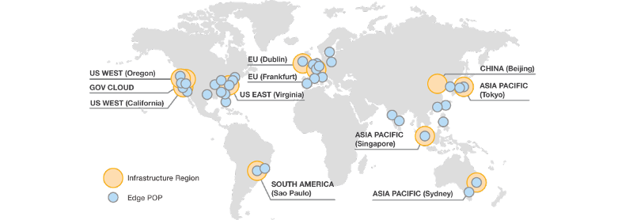

# Table of Contents

1. [Preface](README.md#markdown-header-preface)
2. [Cloud Front Distribution](README.md#markdown-header-cloud-front-distribution)

* * *

# Preface

The AWS Cloud infrastructure is built around Regions, at the time of writing 16, and Availability Zones, 44, but on top of these AWS also supports a worlwide network of edge locations which is where the end users access services located at AWS. Edge locations are located in most of the major cities around the world and are **specifically used by CloudFront**, the AWS Content Delivery Network solution, aka CDN, to distribute content to end user to reduce latency. 

**From the description above is clear that the number of Regions is much less than the number of Edge Locations in the AWS Global Infrastructure, and this is because a CDN should always try to guarantee the lowest latency possible and therefore its servers have to be more widespread geographically.**

To better clarify few key terminology let's consider the example below:

A company holds an S3 bucket in the London region that hosts a static website. User requests, to access content in that bucket, must always be routed in the London region as that's the **Origin**. This setup, however, introduces high latency for all that users that are geographically located far from the **Origin**, think America. To avoid this problem a new **Distribution** can be configured in CloudFront for the **Origin**, in our case the S3 bucket, wich in turn contains the list of edge locations where the content will be cached.

When a Distribution is configured all the user requests are always sent to the closest edge location, geographically speaking, and this, in turn retrieves the content from the Origin and caches it to serve future requests. Content cached at the Edge Location level expires after an amount of time, TTL, configured by the user in the distribution.

Below a map of the AWS Global Infrastructure showing Regions and Edge Locations.

CloudFront is seamlessly integrated with all the AWS service but also supports Origins that are located outside the AWS infrastructure. Edge locations are not just read only so the user can put content into it. Cached information can be cleared on demaand but AWS applies a charge for it.

[*(back to the top)*](README.md#markdown-header-table-of-contents)

* * *

# Cloud Front Distribution

CloudFront supports two different types of distributions:

1. **Web**, to speed up the distribution of web content, like static web pages.
2. **RTMP**,  to speed up the distribution of streaming media files using Adobe Flash Media Server RTMP protocol.

Further important things to remember:

- The default TTL for the content is set to 24 hours. 
- Distributions supports pre-signed URLs like in S3.
- Distributions supports geo restrictions. 
- Invalidation can be configured to remove objects from the cache, but AWS charges extra money for this.