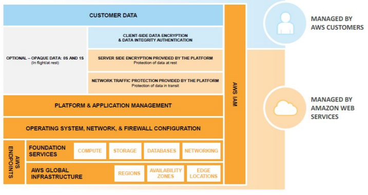

# Table of Contents

1. [Preface](README.md#markdown-header-preface)
2. [The trusted Advisor](README.md#markdown-header-trusted-advisor)

* * *

# Preface

When evaluating the security of a cloud solution, it is important for customers to understand and distinguish between:

- Security measures that the cloud service provider (AWS) implements and operates – "security of the cloud".
- Security measures that the customer implements and operates, related to the security of customer content and applications that make use of AWS services – "security in the cloud".

While AWS manages security of the cloud, security in the cloud is the responsibility of the customer.
To better enforce those concepts AWS offers a shared responsibility models for each of the different types of service that are provided to the customers.
The security best practice document drafted by AWS partitions those services into 3 main categories, responsibilities are depicted in the images below.

- Infrastructure services. (eg. EC2, EBS VPCs etc..)

- Container services (eg. RDS and EMR etc..).

- Abstracted services (DynamoD, SQS, SNS, S3 etc..).

[*(back to the top)*](README.md#markdown-header-table-of-contents)

* * *

# The Trusted Advisor

The AWSTrusted Advisor tool offers a one-view snapshot of the service being used and helps identify common security misconfigurations, suggestions for improving system performance, and
underutilized resources.

[*(back to the top)*](README.md#markdown-header-table-of-contents)

* * *

