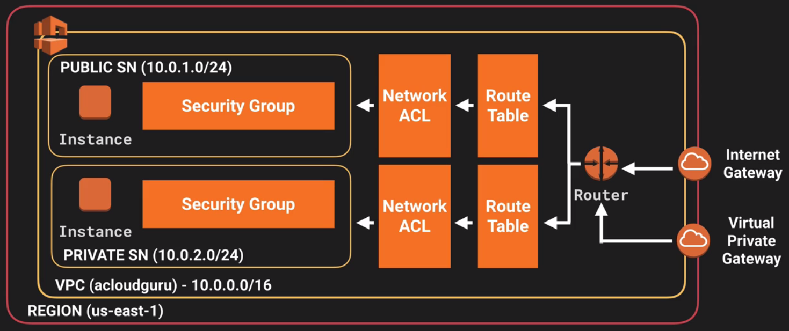

# Table of Contents

1. [Preface](README.md#markdown-header-preface)
2. [VPC core components](README.md#markdown-header-vpc-core-components)
    * [VPC](README.md#markdown-header-vpc)
    * [Subnet](README.md#markdown-header-subnet)
    * [Internet Gateway](README.md#markdown-header-internet-gateway)
    * [Route tables](README.md#markdown-header-route-tables)
    * [NAT Instances and NAT Gateways](README.md#markdown-header-nat-instances-and-nat-gateways)
    * [Network Access Control List](README.md#markdown-header-network-access-control-list)
    * [Security Groups](README.md#markdown-header-security-groups)
    * [Peering Connection](README.md#markdown-header-peering-connection)
3. [Bastion instance](README.md#markdown-header-bastion-instance)
4. [Flow logs](README.md#markdown-header-flow-logs)

* * *

# Preface

Amazon VPC is a regional service that allows to provision a logically isolated section of the AWS cloud where users can launch AWS resources. VPC offers the possibility to have complete control over the virtual networking environment including:

- Selection of a specific IP address range.
- Creation of subnets.
- Configuration of route tables and network gateways.
- Configuration of NACLs for security purposes.

[*(back to the top)*](README.md#markdown-header-table-of-contents)

* * *

# VPC core components

In this paragraph the main VPC core components will be discussed, the overall Architectural Diagram is described in the image below:



## VPC

A Virtual Private Cloud is a logically isolated virtual network in the AWS Cloud that span over all the AWS Availability Zones in the selected Region (**VPC CANNOT SPAN OVER MULTIPLE REGIONS**).
When a new VPC is created three main information must be provided:

- A unique name.
- A CIDR block, which tells AWS the IP class that the VPC resources will be allocating.
- The tenancy (default/dedicated) which tells AWS if the resources in the VPC will be deployed on shared or dedicated hardware.

The CIDR block is a compact notation that is used to define a range of IP addresses in a compact form. CIDR notation is really easy to understand, any IPV4 address is made up of 4 octects (4 groups of 8 bits each, which converted into a decimal form represents all the numbers between 0 and 255). The number that follolws the IP class in a CIDR block tells how many bits, of the octect, left to tight, are fixed. 

e.g.: IP class 10.0.0.0/16 means that the initial 10.0 part is fixed, and will never change, whilst the remaining part 0.0 is variable. The resulting range of IP addresses may then be seen like :

```10.0.[0..255].[0..255]```

VPCs are subject to the following limits:

- Users can only create up to 5 VPCs per region, but this is a soft limit and can be changed via the AWS support. 
- The max size that of a CIDR block that can be used when creating a VPC cannot be bigger than /16.

In order to simplify the creation of a VPC, a wizard is provide to the user with four possible pre-set configurations:

- VPC with a Single Public Subnet Only
- VPC with Public and Private Subnets
- VPC with Public and Private Subnets and Hardware VPN Access
- VPC with a Private Subnet Only and Hardware VPN Access

When a new VPC is created the following default components are created automatically: a Route table, a NACL and a Security Group.

To simplify the deployment of AWS resources a **Default** VPC is always provided when a new AWS account is provisioned, the advise is not to delete this VPC as in order to re-create a Support ticket must be raised with AWS.

## Subnet

Subnets are segments of a VPC's IP address range where the user can place groups of isolated resources. **A max of 200 subnets per VPC can be allocated, Subnets are also always associated to one and only one AWS Availability Zone**. When a new subnet is cretaed the following information must be provided:

- A subnet name.
- The VPC the subnet belongs to.
- The CIDR block as a subset of the bigger CIDR block specified at the VPC level.
- The availability zone where the subnet belongs to.

When a new subnet is created the console also shows how many IP addresses are available within that subnet. AWS always reserves 5 ip address per Subnet as follow (assumin an IP class of 10.0.0.0):

- **10.0.0.0**. Network address.
- **10.0.0.1**. VPC router.
- **10.0.0.2**. The IP address of the DNS server
- **10.0.0.3**. Reserved by AWS for future use.
- **10.0.0.255**. Network broadcast address. **AWS do not support broadcast in a VPC, therefore address stays reserved.**.

Subnet have the option to auto-assign a public IP address to all the resoures that are created within it. This option is not directly available when the subnet is first created through the consolle wizard but becomes available later on.

## Internet Gateway

An Internet gateway, aka IGW, is a horizontally scaled, redundant, and highly available VPC component that allows communication between instances in a VPC and the Internet. An Internet gateway serves two purposes::

- To provide a target in a VPC route tables for Internet-routable traffic
- To perform network address translation (NAT) for instances that have been assigned public IPv4 addresses.

An Internet gateway supports IPv4 and IPv6 traffic.

When a new IGW is created, a logic name is assigned to it, then it is necessary to attach it to an existing VPC.
Every VPC can only have attached one and only one IGW.

## Route tables

A route table contains a set of rules that are used to determine where network traffic is directed. Each subnet in a VPC must be associated with one and only one route table at a time, but it is possible to associate multiple subnet with the same route table.
By definition a Subnet that is associated to a Route table that has a route to an Internet Gateway is a **Public Subnet**, whilst all that subnet that are associted to a Route table that doesn't have such routing rule can be considered **Private**.

## NAT Instances and NAT Gateways

Sometime resources in private subnet require an Internet Access (e.g. an EC2 instance that needs to download software updates), for this purpose 2 possible strategies can be used:

- **NAT instance**. Nowadays this may be considered a legacy approach, it represents the first solution that AWS provided to its customers for the sole purpose of connecting instances in private subnet to the Internet (prior to 2016 when the NAT gateways was introduced). A NAT instance is basically an EC2 instance, AWS provides several AMIs to implement the NAT server, that can deployed in a public subnet to serve outbound internet traffic to instances located into private subnet. In order to deploy a NAT instance the following actions are required:
    * Deploy an EC2 instance in the **public subnet** of the chosen VPC using one of the designated AWS NAT AMIs. When creating the instance a Security Group must be chosen.
    * Disable, on the EC2 instance networking configuration, the **Source/Destination Checks** option. Each EC2 instance performs source/destination checks by default. This means that the instance must be the source or destination of any traffic it sends or receives. However, a NAT instance must be able to send and receive traffic when the source or destination is not itself.
    * Add a new route on the routing table that is assigned to the private subnet to flow the traffic through the NAT instance in the public subnet.
- **NAT Gateway**. This is a highly available, managed Network Address Translation (NAT) service that resources in a private subnet can use to access the Internet. When a new NAT Gateway is created two main information must be provided:
    * A public subnet where the Gateway service will be deployed.
    * An allocated Elastic IP Address to be used by the Gateway.
    * **Upon creation of a new NAT Gateway a new route on the routing table that is assigned to the private subnet to flow the traffic through the NAT instance in the public subnet must be created.**

An important consideration to keep in mind about NAT instances is that these are fully managed by the customer and may represent a Single point of failure as well as a network bottleneck for Internet access for private subnet. Let's tackle this consideration separately:

- Fully managed by the user. As NAT instances are effectively EC2 instances the customer is in charge of patching and maintaining the instance itself.
- Single point of failure. Again due to their nature, of instance, a fault may always happen and involve the instance itself or the AZ where it has been deployed. If this happens private subnet would not be able to access the Internet anymore. AWS always suggests to implement redundancy on NAT instances using AutoScaling groups.
- Network bottleneck. As stated in the documentation NAT instances max bandwidth is strictly related to the max bandwidth available at the instance level. Smaller is the instance capacity reduced will be the bandwidth available for the Internet Access.

Such considerations don't apply for NAT Gateways as in this case the service is fully managed by AWS.

## Network Access Control List

A network access control list, aka NACL, is an optional layer of security for VPCs that acts as a firewall for controlling traffic in and out of one or more subnets. VPC automatically comes with a modifiable default NACL that by default allows all inbound and outbound traffic.

Each subnet in a VPC must be associated with a network ACL, however if a subnet is not explicitly associate then the default NACL, provisioned when the VPC was created, is automatically selected. Network ACL can be associated to multiple subnets at the same time however a subnet can be associated with one and only one NACL at a time. Custom network ACLs by default denies all inbound and outbound traffic until new rules are added. When a new NACL is created, and before definining the rules, the following information must be provided:

- A logical name.
- A target VPC.

A network ACL contains a numbered list of rules that are evaluate in order, starting with the lowest numbered rule, to determine whether traffic is allowed in or out of any subnet associated with the network ACL. The highest number that can be used for a rule is 32766 AWS recommends creating rules with rule numbers that are multiples of 100, so that new rules can be inserted where needed later on. A NACL consists of separate inbound and outbound rules, and each rule can either allow or deny traffic. The following are the parts of a network ACL rule:

- Rule number.
- Protocol. 
- [Inbound rules only] The source of the traffic (CIDR range) and the destination (listening) port or port range.
- [Outbound rules only] The destination for the traffic (CIDR range) and the destination port or port range.
- Choice of ALLOW or DENY for the specified traffic.

Each network ACL includes a default rule whose rule number is an asterisk. This can be treated as a default rule that applies in case a packet doesn't match any of the other rules defined in the NACL.

Network ACLs are stateless whilst Security Group statefull. The main difference is that Security groups remembers the incoming request and allow the response to flow out without defining any additional outbound rule, NACLs instead need a separate inbound and outbound rule.

A common exam question is about DDOS attack and IP blacklisting, in this case NACLs must be used as Security groups don't allow to blacklist range of IP addresses. 

An ephemeral port is a short-lived endpoint that is created by the operating system when a program requests any available user port. The operating system selects the port number from a predefined range, typically between 1024 and 65535, and releases the port after the related TCP connection terminates. When an inbound request is received the response is usually sent over an ephemeral port that is allocated on the fly by the OS, this is an important concept to keep in mind when troubleshouting issue in VPC up as the problem may be caused by a NACL that doesn't ALLOW traffic through ephemeral ports.

## Security Groups

Security Groups are Virtual Firewall at instance level and represent the first level of defense for our Cloud instances. Each instance can be assigned to one or more Security Groups and each Security Group is made up of several Inbound and Outbound rules, these rules applies immediately after that the settings have been saved (zero delay). When creating a new Security Group, by default, all the Inbound traffic is denied by default whilst all the Outbound traffic is allowed.

SecurityGroups are Stateful so when a new Inbound rule is created all the outbound response traffic that is being generated as part of the inbound request will be always allowed. ACLs instead are Stateless so an explicit Outbound rule has to be specified. Is not possible to block specific IP Addresses using Security Groups for this purpose ACLs must be used.

## Peering Connection

A VPC peering connection is a networking connection between two VPCs that enables to route traffic between them. Instances in either VPC can communicate with each other as if they are within the same network. VPC peering connection can be configured between VPCs in the same AWS account, or with a VPC in another AWS account. In both cases, the VPCs must be in the same region.

AWS uses the existing infrastructure of a VPC to create a VPC peering connection; it is neither a gateway nor a VPN connection, and does not rely on a separate piece of physical hardware. There is no single point of failure for communication or a bandwidth bottleneck. In order to create a VPC the following information/action are needed:

- Peering connection name tag.
- VPC (Requester). The VPC in the customer account with which we want to create the VPC peering connection.
- Another VPC to peer with.

Upon Peer creation two more actions are needed:

- Enbale the peer to Accept Request.
- Add an entry to the VPC route tables to enable traffic to be directed between the peered VPCs. 

Few scenarios to keep in mind are:

- **Overlapping CIDR blocks**. Customer cannot create a VPC peering connection between VPCs with matching or overlapping IPv4 CIDR blocks. 
- **Transitive Peering**. Lets assume we have a VPC peering connection between VPC-A and VPC-B, and between VPC-A and VPC-C. There is no VPC peering connection between VPC-B and VPC-C. Customer cannot route packets directly from VPC-B to VPC-C through VPC-A. as peering is not transitive
- **Edge to Edge Routing Through a Gateway or Private Connection**. If VPC-A and VPC-B are peered, and VPC-A has any of the connections described below, then instances in VPC-B cannot use the connection to access resources on the other side of the connection. Similarly, resources on the other side of a connection cannot use the connection to access VPC-B.
	* A VPN connection or an AWS Direct Connect connection to a corporate network.
	* An Internet connection through an Internet gateway.
    * An Internet connection in a private subnet through a NAT device.
    * A VPC endpoint to an AWS service; for example, an endpoint to Amazon S3.
    * A ClassicLink connection.

[*(back to the top)*](README.md#markdown-header-table-of-contents)

* * *

# Bastion instance

Instances in private subnets are not accessible directly from the internet, outbound connections are made available via NAT instances and/or NAT Gateway but inbound traffic is never allowed (remember that instances in the private subnets are not provided with a public IP address). This security constraint imposes a big limitation as customer cannot directly connect to the instance for maintainance purposes. 

To overcome this issue a Bastion instance, also known as Jump box, practically an EC2 instance, can be deployed in a public subnet of the VPC and used as a bridge to connect to the instances located in the private subnet (via ssh and/or rdp).

**Bastion host are totally unrelated with NAT instances and NAT Gateway as serve different purposes.**

[*(back to the top)*](README.md#markdown-header-table-of-contents)

* * *

# Flow Logs

VPC Flow Logs is a feature that enables customers to capture information about the IP traffic going to and from network interfaces in a VPC. Flow log data is stored using Amazon CloudWatch Logs and can help to troubleshoot why specific traffic is not reaching an instance, which in turn can help to diagnose overly restrictive security group rules. Flow Logs can also be used as a security tool to monitor the traffic that is reaching the instances.

Flow Logs feature is configured at VPC level and in order to enable it  two requirements must be met:

1. A role that writes data into CloudWatch Logs is available.
2. A CloudWatch Log container is created.

A single FlowLog record contains the following data:

Field | Description
--- | ---
version | The VPC flow logs version.
account-id | The AWS account ID for the flow log.
interface-id | The ID of the network interface for which the log stream applies.
srcaddr | The source IPv4 or IPv6 address. The IPv4 address of the network interface is always its private IPv4 address.
dstaddr | The destination IPv4 or IPv6 address. The IPv4 address of the network interface is always its private IPv4 address.
srcport | The source port of the traffic.
dstport | The destination port of the traffic.
protocol | The IANA protocol number of the traffic. For more information, go to Assigned Internet Protocol Numbers.
packets | The number of packets transferred during the capture window.
bytes | The number of bytes transferred during the capture window.
start | The time, in Unix seconds, of the start of the capture window.
end | The time, in Unix seconds, of the end of the capture window.
action | The action associated with the traffic: ACCEPT: The recorded traffic was permitted by the security groups or network ACLs. REJECT: The recorded traffic was not permitted by the security groups or network ACLs.
log-status | The logging status of the flow log: OK: Data is logging normally to CloudWatch Logs. NODATA: There was no network traffic to or from the network interface during the capture window. SKIPDATA: Some flow log records were skipped during the capture window. This may be because of an internal capacity constraint, or an internal error. 


[*(back to the top)*](README.md#markdown-header-table-of-contents)