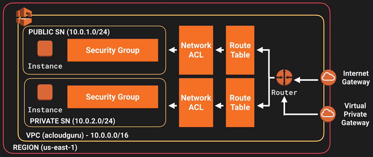

# Table of Contents

1. [Preface](README.md#markdown-header-preface)
2. [VPC core components](README.md#markdown-header-vpc-core-components)
    * [VPC](README.md#markdown-header-)
    * [Subnet](README.md#markdown-header-)
    * [Internet Gateway](README.md#markdown-header-)
    * [NAT Gateway](README.md#markdown-header-)
    * [Peering Connection](README.md#markdown-header-)
3. [The VPC Wizard](README.md#markdown-header-the-vpc-wizard)

* * *

# Preface

Amazon VPC is a regional service that allows to provision a logically isolated section of the AWS cloud where users can launch AWS resources in a virtual network defined by them.
VPC offers to the users the possibility to have complete control over the virtual networking environment including:

- Selection of a specific IP address range.
- Creation of subnets.
- Configuration of route tables and network gateways.
- Configuration of NACLs for security purposes.

[*(back to the top)*](README.md#markdown-header-table-of-contents)

* * *

# VPC core components

In this paragraph a detailed explanation of the main VPC core components, and related configurations, is provided.
The VPC architecture is also described in the image below:

## VPC

A Virtual Private Cloud (VPC): A logically isolated virtual network in the AWS cloud. You define a VPC’s IP address space from a range you select.

## Subnet

Subnet: A segment of a VPC’s IP address range where you can place groups of isolated resources.

## Internet Gateway

Internet Gateway: The Amazon VPC side of a connection to the public Internet.
## NAT Gateway

A highly available, managed Network Address Translation (NAT) service for your resources in a private subnet to access the Internet.

## Peering Connection

A peering connection enables you to route traffic via private IP addresses between two peered VPCs.

[*(back to the top)*](README.md#markdown-header-table-of-contents)

* * *

# The VPC Wizard

VPC with a Single Public Subnet Only
VPC with Public and Private Subnets
VPC with Public and Private Subnets and Hardware VPN Access
VPC with a Private Subnet Only and Hardware VPN Access